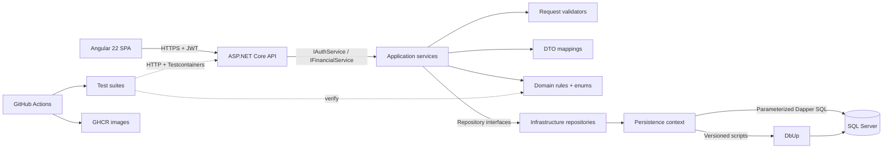

# LedgerFlow

[](https://github.com/omatheussribeiro/ledgerflow/actions/workflows/ci.yml)
[](https://dotnet.microsoft.com/)
[](https://angular.dev/)
[](LICENSE)

LedgerFlow is a full-stack financial management platform built to make personal and professional cash flow understandable. It pairs a focused Angular workspace with a secure .NET API, explicit Dapper queries, a constrained SQL Server schema, automated tests and container-first delivery.

> This repository favors visible trade-offs over ceremonial abstractions. The current release is a working portfolio MVP: authentication, accounts, categories, transactions, dashboard and reports are implemented end to end. Transfers, cost centers and recurring entries are intentionally tracked in the roadmap.

## Overview

LedgerFlow gives each authenticated user an isolated financial workspace. Users can register, manage accounts and categories, record income or expenses, search a paginated ledger and inspect monthly indicators. The backend owns all authorization and validation; the browser never decides which rows a user may access.

The API starts by applying idempotent DbUp migrations. In Development only, it can add a demo workspace. SQL remains close to the repository that owns it, which makes joins, grouping, CTEs, pagination and execution plans straightforward to inspect.

## Features

- JWT access tokens, rotating opaque refresh tokens, revocation and role/policy support
- Accounts with computed balances and explicit account types
- Income/expense categories with report colors
- Financial transactions with status, notes, server validation and secure filters
- Dashboard with total balance, monthly income/expenses/result, six-month evolution, category breakdown and recent activity
- Reports with savings rate, period averages and expense concentration
- Responsive Angular UI with standalone components, signals, reactive forms, lazy routes, guard and interceptor
- Environment-based API endpoint configuration and isolated HTML, TypeScript and SCSS component files
- RFC 7807 `ProblemDetails`, correlation IDs, structured request logging and safe production errors
- Explicit application DTOs, validators, mappings and dependency-injected service/repository contracts
- DbUp migrations, development-only demo data and documented indexing decisions
- Unit, integration and architecture tests; SQL Server integration tests use Testcontainers
- Multi-stage Docker builds, Docker Compose, CI checks and semantic-version image publication to GHCR

## Screenshots

The implemented UI includes five responsive views:

| View | What it demonstrates |
| --- | --- |
| Sign in / registration | Clear authentication states, validation and demo access |
| Dashboard | KPI cards, cash-flow bars, category concentration and activity feed |
| Transactions | Secure filters, pagination and a complete reactive entry form |
| Accounts / categories | Focused creation workflows and empty states |
| Reports | Savings rate, rolling averages and spending concentration |

Screenshots can be added under `docs/images/` as the visual language evolves; the source UI is the canonical representation and is available immediately through Docker Compose.

## Architecture



Dependencies point inward where it matters:

- **LedgerFlow.Domain** contains financial rules and one file per enum under `Enums`; it has no project dependencies.
- **LedgerFlow.Application** defines DTOs, mappings, validators, use cases and repository/service interfaces.
- **LedgerFlow.Infrastructure** implements repository and security ports. `Persistence/Context` owns connections, migrations, development seed and table configurations.
- **LedgerFlow.Api** is the delivery/composition layer: controllers, JWT issuance, middleware, OpenAPI and DI.
- **LedgerFlow.Web** is a separately deployable Angular application organized by `core` and `features`.

Controllers depend on `IAuthService` and `IFinancialService`; services depend on repository/security interfaces; only Infrastructure knows the Dapper implementations. There is one repository abstraction per coherent persistence boundary, not one interface per table or command.

## Technology Stack

| Area | Technology |
| --- | --- |
| API | .NET 10, ASP.NET Core controllers, C# |
| Data | SQL Server 2022, Dapper, Microsoft.Data.SqlClient, DbUp |
| Security | JWT Bearer, opaque refresh tokens, PBKDF2-SHA512, policies |
| Web | Angular 22, TypeScript 6, standalone components, signals, RxJS |
| Observability | Serilog, structured request logs, correlation IDs |
| Tests | xUnit, FluentAssertions, NetArchTest, Testcontainers, Vitest |
| Delivery | Docker, Nginx, Docker Compose, GitHub Actions, GHCR |

## Project Structure

```text
LedgerFlow/
├── src/
│   ├── LedgerFlow.Api/             # HTTP, auth, middleware, composition root
│   ├── LedgerFlow.Application/
│   │   ├── Dtos/                   # Request and response models
│   │   ├── Interfaces/
│   │   │   ├── Repositories/       # Persistence ports
│   │   │   └── Services/           # Use-case and technical service ports
│   │   ├── Mappings/               # Domain-to-DTO transformations
│   │   ├── Services/               # Application use cases
│   │   └── Validators/             # Explicit request validation
│   ├── LedgerFlow.Domain/
│   │   ├── Enums/                  # One enum per file
│   │   ├── Financial/              # Financial entities and rules
│   │   └── Identity/               # User domain model
│   ├── LedgerFlow.Infrastructure/
│   │   ├── Persistence/
│   │   │   ├── Context/            # Connection, migrations and seed
│   │   │   │   └── Configurations/ # Table metadata and read projections
│   │   │   ├── Migrations/         # Versioned DbUp scripts
│   │   │   └── Repositories/       # Dapper implementations
│   │   └── Security/               # Password hashing adapter
│   └── LedgerFlow.Web/             # Angular application
├── tests/
│   ├── LedgerFlow.UnitTests/
│   ├── LedgerFlow.IntegrationTests/
│   └── LedgerFlow.ArchitectureTests/
├── docs/adr/                       # Architectural decision records
├── .github/workflows/              # CI and image publication
└── compose.yaml
```

## Database

SQL Server is the source of truth. The schema uses `uniqueidentifier` keys, `decimal(19,2)` for money, UTC `datetimeoffset`, foreign keys, tenant-aware unique constraints and check constraints for roles, types, status, colors and positive transaction amounts.

Notable indexes:

- `IX_Transactions_User_OccurredOn` supports the chronological user feed, period filters and pagination while including fields used by the read model.
- `IX_Transactions_Account_Status` supports balance aggregation by account without a full transaction scan.
- `IX_Transactions_User_Type_OccurredOn` supports income/expense period reporting and category aggregation.
- `IX_RefreshTokens_User_ExpiresAt` supports session cleanup; the unique token-hash constraint handles token lookup.

Indexes are tied to actual repository queries. More indexes are not automatically better: each one adds storage and write amplification.

## Migrations

LedgerFlow uses **DbUp**, because schema changes are SQL-first and should not introduce EF Core solely as a migration tool. Scripts are embedded in `LedgerFlow.Infrastructure`, sorted by name and journaled by DbUp:

```text
001_CreateUsers.sql
002_CreateAccountsAndCategories.sql
003_CreateTransactions.sql
004_CreateRefreshTokens.sql
005_CreateIndexes.sql
```

The API runs pending migrations at startup when `Database__RunMigrations=true`. DbUp creates the database when needed and records executed scripts in `SchemaVersions`. Never edit an applied migration; add the next numbered script.

Development seed data runs only under the `Development` environment when `Database__SeedDevelopmentData=true`:

```text
demo@ledgerflow.dev / DemoPass123!
```

Production never enables this seed.

### Persistence context and table configuration

`LedgerFlowDbContext` centralizes the SQL Server connection string and creates open, cancellable connections for repositories and seed operations. `DatabaseInitializer` and `DevelopmentDataSeeder` live beside it under `Persistence/Context`.

Because the project uses Dapper rather than EF Core, table configuration is intentionally SQL-oriented: the classes under `Context/Configurations` centralize qualified table names and reusable read projections. The migrations remain the authoritative DDL definition for columns, constraints, indexes and relationships. Repositories live exclusively under `Persistence/Repositories` and consume the Application interfaces. Query results are first materialized into Infrastructure read models using provider-native types (`byte`, `DateTime`) and then explicitly converted to Application DTO enums and `DateOnly` values.

## Why Dapper?

Dapper is a deliberate fit for this project, not a claim that a micro-ORM is universally superior.

**Advantages:** the executed SQL is visible and predictable; report queries can use the database naturally; projections transfer only required columns; there is no change tracker; and query plans are easy to relate to repository code. LedgerFlow demonstrates joins, conditional `SUM`, `COUNT`, a month-generating CTE, multi-result queries, pagination and safe dynamic filters.

**Costs:** developers own mapping, migrations, relationship handling and query/schema synchronization. CRUD requires more SQL and refactors do not automatically flow through queries. Poor SQL is still poor SQL; Dapper does not create performance by itself.

**Security and maintainability:** every value is passed as a parameter. Dynamic filtering appends only fixed, code-owned SQL fragments and puts user values in `DynamicParameters`. No user input becomes an identifier or SQL fragment. Cancellation tokens flow through `CommandDefinition`, and multi-step refresh-token rotation uses a database transaction and update lock.

Dapper is a good choice when a team is comfortable owning SQL, read models matter, query control is valuable and the domain does not need a sophisticated unit-of-work/change-tracking model. I would likely choose EF Core for a CRUD-heavy system with large aggregate graphs, frequent schema evolution and a team whose productivity benefits more from LINQ and tracked persistence than from SQL-level control. A hybrid can also be valid when boundaries remain explicit.

## Authentication

Passwords are salted and hashed with PBKDF2-SHA512 (210,000 iterations); plaintext passwords are never stored. Access tokens expire after 15 minutes. Refresh tokens are 64-byte random opaque values, last seven days, are stored only as SHA-256 hashes, and rotate atomically. Logout revokes the presented refresh token.

Protected repository queries always require the authenticated `UserId`. `User` and `Admin` roles are supported, with an `AdminOnly` policy ready for administrative endpoints.

For a browser-facing production deployment, consider moving the refresh token from web storage to a hardened `HttpOnly`, `Secure`, `SameSite` cookie and adding CSRF protection. The current explicit token contract keeps the portfolio API easy to exercise through Swagger and non-browser clients.

## Security

- Parameterized SQL only; no direct value concatenation
- Server-side model and domain validation regardless of Angular validation
- Global exception mapping to RFC 7807 without production stack traces
- Explicit CORS origin allowlist and fixed-window API rate limiting
- Correlation ID, `nosniff`, frame denial, referrer and permissions-policy headers
- Minimum 256-bit JWT signing key enforced on startup
- Secrets supplied through environment variables or secret stores, never committed
- Non-root API container and minimal runtime images
- NuGet/npm vulnerability auditing during restore/install

The development password and signing key are visibly development-only. Replace all values from `.env.example`; never reuse them outside a local machine.

## Testing

```bash
dotnet test LedgerFlow.slnx
cd src/LedgerFlow.Web
npm test -- --watch=false
npm run lint
```

- **Unit tests** protect monetary normalization, positive-amount rules, category color rules, mappings and application validators.
- **Architecture tests** prevent inward layers from depending on API/infrastructure and enforce controller conventions.
- **Integration tests** start a real SQL Server container, apply real migrations, host the API in memory and exercise registration plus an authenticated account journey.
- **Frontend tests** use Angular's Vitest-based runner and cover API URL/query composition, account mutations, login, registration, logout/session persistence, auth headers and the application shell. The strict build and ESLint accessibility rules provide additional static checks.

Docker must be running for integration tests. These tests prioritize meaningful boundaries rather than chasing a coverage percentage.

## Docker

Both applications use multi-stage builds. The API publishes into a non-root Alpine runtime; the web build is served by Nginx with SPA fallback. The Angular `environment` files point requests directly to `http://localhost:5080/` for the local and Docker development topology.

```bash
# Linux/macOS: cp .env.example .env
# PowerShell: Copy-Item .env.example .env
# edit both values in .env
docker compose up --build
```

Open <http://localhost:4200>. The API is also available at <http://localhost:5080>; Swagger is at <http://localhost:5080/swagger> in Development.

To stop the stack, run `docker compose down`. Add `-v` only when you intentionally want to delete the local SQL volume and all its data.

## Getting Started

### Option A — complete stack with Docker

Prerequisites: Docker Desktop/Engine with Compose.

1. Copy `.env.example` to `.env`.
2. Set a strong SQL Server password and a random JWT key of at least 32 characters.
3. Run `docker compose up --build`.
4. Visit `http://localhost:4200` and use the demo account or register a new one.

### Option B — run services directly

Prerequisites: .NET SDK 10.0.302+, Node 24.15+, npm 11 and SQL Server 2022/Express. The committed Development profile targets the local `.\SQLEXPRESS` instance with Windows Authentication; override `ConnectionStrings__LedgerFlow` when using another instance.

```bash
# Terminal 1: database only (after configuring .env)
docker compose up sqlserver

# Terminal 2: API
dotnet restore LedgerFlow.slnx
dotnet run --project src/LedgerFlow.Api --urls http://localhost:5080

# Terminal 3: Angular (environment.apiUrl targets port 5080)
cd src/LedgerFlow.Web
npm ci
npm start
```

The first API start creates/updates the database and Development seed. Subsequent starts run only pending migrations.

## Configuration

ASP.NET Core maps double underscores in environment variables to configuration sections:

| Key | Purpose |
| --- | --- |
| `ConnectionStrings__LedgerFlow` | SQL Server connection string |
| `Jwt__SigningKey` | HMAC signing key, minimum 32 bytes |
| `Jwt__Issuer` / `Jwt__Audience` | Token validation boundaries |
| `Jwt__AccessTokenMinutes` | Access-token lifetime |
| `Cors__AllowedOrigins__0` | First allowed SPA origin |
| `Database__RunMigrations` | Apply DbUp scripts on startup |
| `Database__SeedDevelopmentData` | Seed only when environment is Development |

Angular reads `src/environments/environment.ts`; the development replacement is configured in `angular.json`. Both currently use `apiUrl: 'http://localhost:5080/'`. Change the production value at build time when deploying the SPA and API under different public addresses.

Use .NET user-secrets, a platform secret store, Docker/Kubernetes secrets or environment-level secrets. Do not create a real production `appsettings` file in the repository.

## API Documentation

Swagger UI is enabled only in Development at `/swagger`. Operations include XML summaries, parameter descriptions, success schemas, validation/authentication/conflict responses and JWT requirements. Click **Authorize** and paste the access token returned by `/api/auth/login` (without adding the word `Bearer`). The principal endpoints are:

- `POST /api/auth/register`, `/login`, `/refresh`, `/logout`
- `GET|POST /api/accounts`
- `GET|POST /api/categories`
- `GET|POST /api/transactions`
- `GET /api/dashboard`
- `GET /health`

Successful operations use a consistent envelope:

```json
{
  "success": true,
  "message": "Account created successfully.",
  "data": { "id": "...", "name": "Main account" }
}
```

Failures use RFC 7807 `ProblemDetails` with a stable error code and correlation identifier:

```json
{
  "success": false,
  "title": "Business rule violation",
  "status": 422,
  "detail": "Amount must be greater than zero.",
  "message": "Amount must be greater than zero.",
  "code": "business_rule_violation",
  "traceId": "..."
}
```

| Status | Meaning |
| --- | --- |
| `200 OK` | Query, authentication, refresh or logout completed |
| `201 Created` | User, account, category or transaction created |
| `400 Bad Request` | Binding or request validation failure |
| `401 Unauthorized` | Missing, invalid or rejected authentication |
| `403 Forbidden` | Authenticated user lacks permission |
| `404 Not Found` | Endpoint or requested resource does not exist |
| `409 Conflict` | Duplicate or conflicting resource |
| `422 Unprocessable Entity` | Domain/business rule violation |
| `429 Too Many Requests` | Authentication rate limit exceeded |
| `500 Internal Server Error` | Unexpected API failure; use `traceId` for support |
| `503 Service Unavailable` | Database is temporarily unavailable |
| `504 Gateway Timeout` | Operation timed out |

Validation failures use `ValidationProblemDetails` with a field-to-messages dictionary. Request DTOs are validated in the Application layer before domain creation, while mappings keep domain entities out of the HTTP contract. Internal exception details and stack traces are never returned to clients.

## CI/CD

```text
Pull Request
    ↓
GitHub Actions
    ├── Backend restore → build → unit → architecture → integration tests
    └── Frontend npm ci → lint → tests → production build
    ↓
Version tag v1.0.0
    ↓
Docker build → GHCR
    ├── ghcr.io/<owner>/ledgerflow-api
    └── ghcr.io/<owner>/ledgerflow-web
```

CI runs on pushes and pull requests targeting `main`. The release workflow runs only for semantic version tags and uses the repository-scoped `GITHUB_TOKEN` with `packages: write`. No private configuration belongs in the public README.

## Observability

Serilog emits structured application and request logs. Incoming `X-Correlation-ID` is validated or generated, returned to the caller and placed in the log context. Health and RFC 7807 responses provide operational entry points.

OpenTelemetry is intentionally not a runtime requirement for local development. The API boundary is ready for optional OTLP traces and metrics through standard ASP.NET Core instrumentation when a collector is introduced; exporter choice should remain deployment configuration, not domain code.

## Performance

- Async database and HTTP paths with cancellation support
- Read models projected directly by SQL rather than loading entity graphs
- `QueryMultipleAsync` for dashboard round-trip consolidation
- Server-side pagination capped at 100 rows
- Covering indexes aligned to feed, balance and report queries
- Angular lazy route chunks and a small production bundle
- Docker/GitHub Actions layer and dependency caching

Performance decisions should be validated with representative data and actual query plans. The repository does not make context-free latency claims.

## Architectural Decisions

- [ADR 001 — Dapper](docs/adr/001-use-dapper.md)
- [ADR 002 — SQL Server](docs/adr/002-use-sql-server.md)
- [ADR 003 — Angular](docs/adr/003-use-angular.md)
- [ADR 004 — JWT authentication](docs/adr/004-use-jwt-authentication.md)
- [ADR 005 — GitHub Actions](docs/adr/005-use-github-actions.md)

## Roadmap

- [ ] Atomic transfers between accounts with paired ledger entries
- [ ] Cost centers and project/client allocation
- [ ] Recurrence rules and idempotent scheduled materialization
- [ ] Budgets, goals and forecast scenarios
- [ ] CSV/OFX import with preview and duplicate detection
- [ ] PDF/CSV report export
- [ ] Refresh token in hardened browser cookie with CSRF protection
- [ ] Optional OpenTelemetry collector profile and dashboards
- [ ] End-to-end browser tests and visual regression baselines

## GitHub repository metadata

Suggested description:

> Financial management platform built with .NET 10, Angular, SQL Server and Dapper, focused on clean architecture, optimized SQL, security, automated testing and CI/CD.

Suggested topics: `dotnet`, `dotnet10`, `aspnetcore`, `csharp`, `angular`, `typescript`, `dapper`, `sqlserver`, `clean-architecture`, `rest-api`, `jwt`, `xunit`, `docker`, `github-actions`, `ci-cd`, `opentelemetry`, `serilog`, `fullstack`, `software-architecture`, `portfolio`.

## License

LedgerFlow is available under the [MIT License](LICENSE).
